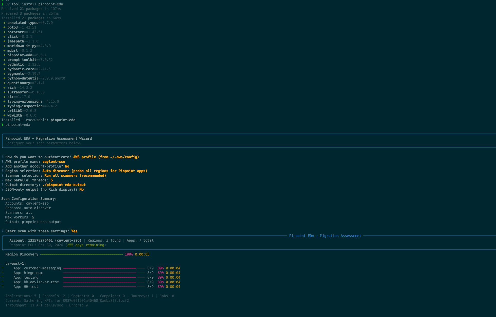

# Pinpoint EDA - Migration Assessment CLI

Read-only migration complexity assessment for **Amazon Pinpoint** end-of-support (October 30, 2026).

Scans all Pinpoint resources across regions and accounts, scores migration complexity, and generates a report with migration target recommendations.



## Installation

```bash
# With uv (recommended)
uv tool install pinpoint-eda

# Or with pip
pip install pinpoint-eda
```

## Quick Start

```bash
# Interactive wizard -- auto-discovers AWS profiles from ~/.aws/
pinpoint-eda

# Direct scan with a profile
pinpoint-eda scan --profile my-profile

# Specific region (skip auto-discovery)
pinpoint-eda scan --profile my-profile --region us-east-1

# Multi-account
pinpoint-eda scan --profile prod --profile staging

# Dry run -- discover apps without scanning
pinpoint-eda scan --profile my-profile --dry-run

# Re-render or export a previous report
pinpoint-eda report ./pinpoint-eda-output/pinpoint-eda-report.json
pinpoint-eda export ./pinpoint-eda-output/pinpoint-eda-report.json
```

## Commands

| Command | Description |
|---------|-------------|
| `pinpoint-eda` | Interactive configurator (discovers profiles from `~/.aws/`) |
| `pinpoint-eda scan` | Run a migration assessment scan |
| `pinpoint-eda report <file>` | Re-render a JSON report in the terminal |
| `pinpoint-eda export <file>` | Export a JSON report to CSV files |
| `pinpoint-eda list-scanners` | Show available scanners |

## Scan Options

| Flag | Default | Description |
|------|---------|-------------|
| `--profile` / `-p` | env/default | AWS profile (repeatable) |
| `--region` / `-r` | auto-discover | AWS region (repeatable) |
| `--role-arn` | none | IAM role ARN for cross-account (repeatable) |
| `--external-id` | none | External ID for role assumption |
| `--app-id` / `-a` | all | Specific app IDs (repeatable) |
| `--scanner` / `-s` | all | Specific scanners (repeatable) |
| `--max-workers` / `-w` | 5 | Parallel threads |
| `--kpi-days` | 90 | KPI history window in days |
| `--output` / `-o` | ./pinpoint-eda-output | Output directory |
| `--resume` | false | Resume an interrupted scan |
| `--fresh` | false | Discard checkpoint, start fresh |
| `--json-only` | false | JSON output only, no Rich display (for CI) |
| `--verbose` / `-v` | false | Debug logging |
| `--no-sms-voice-v2` | false | Skip SMS Voice V2 scanning |
| `--dry-run` | false | Show what would be scanned without scanning |

## Complexity Scoring

The tool assigns a heuristic complexity score to each Pinpoint application to help prioritize migration planning. Scores are **relative estimates** -- they indicate which applications will require more effort compared to others, not how long the migration will take.

### Per-Application Resources

| Resource | Points | How It's Calculated |
|----------|--------|---------------------|
| Journeys | varies | State (active=5, completed=3, draft=1) + activities + 2/branch + 3/integration |
| Campaigns | 3/active, 1/other | Active campaigns need careful cutover |
| Segments | 1 + 3/dynamic + 2/imported | Dynamic segments must be re-implemented in the target service |
| Active channels | 2 each | Per enabled channel type (Email, SMS, Push, etc.) |
| Push + campaigns | +5 | Push channels with active campaigns (no Connect outbound equivalent) |
| Event streams | 3-5 | 5 if app has recent activity, 3 otherwise |
| Campaign hooks | 5 | Lambda integration needs re-wiring |
| Import jobs | 2 | External data pipeline may need redirecting |

### Account-Level Resources

| Resource | Points | How It's Calculated |
|----------|--------|---------------------|
| Templates | 1 each, in-app=8 | In-app messaging templates have no AWS equivalent |
| Recommenders | 5 each | Custom ML integrations via Amazon Personalize |
| SMS/Voice V2 | 2/phone, 2/pool, 3/reg, 1/config set | Phone numbers, pools, registrations, and configuration sets |

### Complexity Levels

| Level | Score | Guidance |
|-------|-------|----------|
| **LOW** | 0-9 | Minimal migration effort |
| **MEDIUM** | 10-29 | Moderate effort, plan 2-4 weeks |
| **HIGH** | 30-69 | Significant effort, plan 1-2 months |
| **VERY HIGH** | 70+ | Major undertaking, plan 2+ months |

> **Disclaimer:** These scores are heuristic estimates to help prioritize migration planning. They are not a substitute for a detailed migration plan. Actual effort depends on your team's familiarity with the target AWS services (Amazon Connect, SES, SNS, etc.), the complexity of your business logic, and how tightly your applications are integrated with Pinpoint-specific features like journeys and in-app messaging. Use these scores as a starting point for conversation, not as a commitment.

## Output

### JSON Report

Every scan produces `pinpoint-eda-output/pinpoint-eda-report.json` containing:
- **Metadata** -- tool version, EOL countdown, scan config, duration, API call count
- **Complexity assessment** -- overall + per-app scores with factors and migration targets
- **Full inventory** -- every resource organized by account, region, app, and scanner

The console summary includes complexity badges, a scoring guide, per-app tables, and a migration target mapping tree.

### CSV Export

```bash
pinpoint-eda export ./pinpoint-eda-output/pinpoint-eda-report.json
pinpoint-eda export ./pinpoint-eda-output/pinpoint-eda-report.json -o ./csv-reports
```

Produces three CSV files:
- **applications.csv** -- one row per app with complexity scores, levels, and migration notes
- **inventory.csv** -- one row per app+scanner with resource counts and flattened metadata
- **account_resources.csv** -- account-level resources (templates, recommenders, SMS/Voice V2) per region

## IAM Permissions

This tool is **read-only** -- it never creates, modifies, or deletes any AWS resources.

### Minimum IAM Policy

A ready-to-use policy is provided at [`iam-policy.json`](iam-policy.json).

| Service | Actions | Purpose |
|---------|---------|---------|
| STS | `sts:GetCallerIdentity` | Resolve the AWS account ID |
| Pinpoint (`mobiletargeting`) | 32 read-only `Get*`/`List*` actions | Scan all Pinpoint resources |
| Pinpoint SMS Voice V2 (`sms-voice`) | 7 `Describe*` actions | Scan phone numbers, pools, registrations |

<details>
<summary>Full inline policy JSON</summary>

```json
{
  "Version": "2012-10-17",
  "Statement": [
    {
      "Sid": "PinpointEDASTSIdentity",
      "Effect": "Allow",
      "Action": "sts:GetCallerIdentity",
      "Resource": "*"
    },
    {
      "Sid": "PinpointEDAReadOnly",
      "Effect": "Allow",
      "Action": [
        "mobiletargeting:GetApp",
        "mobiletargeting:GetApps",
        "mobiletargeting:GetApplicationSettings",
        "mobiletargeting:GetApplicationDateRangeKpi",
        "mobiletargeting:GetSegments",
        "mobiletargeting:GetSegmentVersions",
        "mobiletargeting:GetCampaigns",
        "mobiletargeting:GetCampaignVersions",
        "mobiletargeting:ListJourneys",
        "mobiletargeting:GetJourney",
        "mobiletargeting:GetJourneyExecutionMetrics",
        "mobiletargeting:GetEmailChannel",
        "mobiletargeting:GetSmsChannel",
        "mobiletargeting:GetVoiceChannel",
        "mobiletargeting:GetApnsChannel",
        "mobiletargeting:GetApnsSandboxChannel",
        "mobiletargeting:GetApnsVoipChannel",
        "mobiletargeting:GetApnsVoipSandboxChannel",
        "mobiletargeting:GetGcmChannel",
        "mobiletargeting:GetBaiduChannel",
        "mobiletargeting:GetAdmChannel",
        "mobiletargeting:ListTemplates",
        "mobiletargeting:GetEmailTemplate",
        "mobiletargeting:GetSmsTemplate",
        "mobiletargeting:GetPushTemplate",
        "mobiletargeting:GetInAppTemplate",
        "mobiletargeting:GetVoiceTemplate",
        "mobiletargeting:GetEventStream",
        "mobiletargeting:GetImportJobs",
        "mobiletargeting:GetExportJobs",
        "mobiletargeting:GetRecommenderConfigurations",
        "mobiletargeting:ListTagsForResource"
      ],
      "Resource": "*"
    },
    {
      "Sid": "PinpointEDASMSVoiceV2ReadOnly",
      "Effect": "Allow",
      "Action": [
        "sms-voice:DescribePhoneNumbers",
        "sms-voice:DescribePools",
        "sms-voice:DescribeSenderIds",
        "sms-voice:DescribeOptOutLists",
        "sms-voice:DescribeRegistrations",
        "sms-voice:DescribeConfigurationSets",
        "sms-voice:DescribeKeywords"
      ],
      "Resource": "*"
    }
  ]
}
```

</details>

> **Note:** `Resource: "*"` is required because Amazon Pinpoint does not support resource-level permissions for most read operations. If you skip the SMS Voice V2 scanner (`--no-sms-voice-v2`), you can omit the `PinpointEDASMSVoiceV2ReadOnly` statement.

### Cross-Account Scanning

To scan a different AWS account, create an IAM role in the target account with the policy above and a trust relationship allowing your source account to assume it.

#### 1. Create the role in the target account

Attach [`iam-policy.json`](iam-policy.json) to a new role (e.g., `PinpointEDAReadOnly`), then add this trust policy -- replace `111111111111` with your source account ID:

```json
{
  "Version": "2012-10-17",
  "Statement": [
    {
      "Effect": "Allow",
      "Principal": {
        "AWS": "arn:aws:iam::111111111111:root"
      },
      "Action": "sts:AssumeRole",
      "Condition": {
        "StringEquals": {
          "sts:ExternalId": "pinpoint-eda"
        }
      }
    }
  ]
}
```

#### 2. Grant `sts:AssumeRole` in the source account

```json
{
  "Sid": "AllowCrossAccountAssume",
  "Effect": "Allow",
  "Action": "sts:AssumeRole",
  "Resource": "arn:aws:iam::222222222222:role/PinpointEDAReadOnly"
}
```

#### 3. Run the scan

```bash
# Single target
pinpoint-eda scan --role-arn arn:aws:iam::222222222222:role/PinpointEDAReadOnly

# With external ID
pinpoint-eda scan \
  --role-arn arn:aws:iam::222222222222:role/PinpointEDAReadOnly \
  --external-id pinpoint-eda

# Use a profile as the base session
pinpoint-eda scan \
  --profile hub-account \
  --role-arn arn:aws:iam::222222222222:role/PinpointEDAReadOnly

# Multiple targets from one base profile
pinpoint-eda scan \
  --profile hub-account \
  --role-arn arn:aws:iam::222222222222:role/PinpointEDAReadOnly \
  --role-arn arn:aws:iam::333333333333:role/PinpointEDAReadOnly
```

## Limitations

- **No endpoint data** -- the tool does not scan individual endpoints (contacts/users). Endpoint counts can significantly affect migration timelines but are not included in the score.
- **Point-in-time snapshot** -- the report reflects the state of resources at scan time. Resources may change between scanning and migration.
- **KPI data window** -- activity detection uses the `--kpi-days` window (default 90 days). An app with no recent activity may still have active downstream consumers.
- **Scores are heuristic** -- complexity scores do not account for custom business logic, downstream integrations outside of AWS, or organizational factors like team size and experience.

## Development

```bash
git clone https://github.com/caylent/pinpoint-eda.git
cd pinpoint-eda
uv sync

uv run pytest              # Run tests
uv run ruff check src/ tests/  # Lint
uv run pinpoint-eda --version  # Run locally
```

## License

MIT
